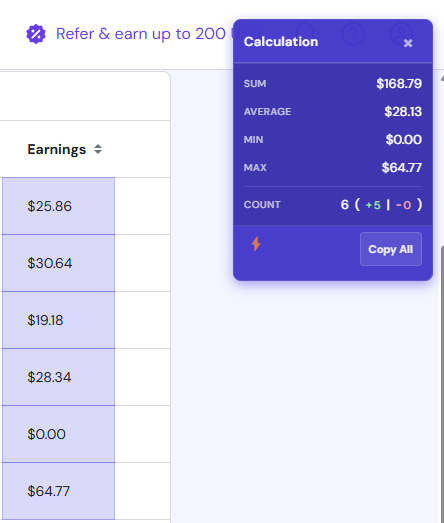
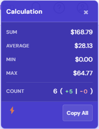

#  Sum Calculator Pro

  
  
  <h3 style="margin-top: 20px; font-weight: 600; color: #4f46e5;">A powerful Chrome extension for instant numerical calculations on any web page</h3>

  

    
    
    
  

## ✨ Features

- **Instant Calculations**: Quickly perform SUM, AVERAGE, MIN, MAX, and COUNT operations on any selected numbers
- **Smart Table Detection**: Works with standard HTML tables, div-based tables, and various UI frameworks
- **Drag Selection**: Select multiple cells with a simple click and drag motion
- **Enhanced Scroll Support**: Continue selecting during scrolling for long tables with intelligent cell detection
- **Live Updates**: See calculation results update in real-time as you select
- **Beautiful UI**: Elegant purple-themed interface with subtle animations
- **Customizable**: Position the calculation panel in any corner of your screen
- **Dark Mode Support**: Automatically adapts to your browser's theme
- **Easy Copying**: One-click to copy all results to your clipboard
- **Smart Currency Detection**: Automatically detects and displays the appropriate currency symbol

## 📸 Screenshots

  
  

## 🚀 Getting Started

### Installation

1. **Download** the extension from the [Chrome Web Store](https://chrome.google.com/webstore/category/extensions) (coming soon!)

   OR

   **Install manually**:
   - Clone this repository: `git clone https://github.com/RaiAnsar/SumCalculator.git`
   - Open Chrome and navigate to `chrome://extensions/`
   - Enable "Developer mode" at the top right
   - Click "Load unpacked" and select the SumCalculator folder

2. **Pin the extension** to your toolbar for easy access

### Usage

1. **Activate the calculator**:
   - Click the Sum Calculator Pro icon in your toolbar to toggle the calculation panel
   - Alternatively, use the keyboard shortcut `Ctrl+Shift+S` (Windows/Linux) or `Cmd+Shift+S` (Mac)

2. **Select numbers**:
   - Click and drag over any numeric cells or text
   - The calculator automatically detects and processes numbers
   - Continue selecting by scrolling while holding the mouse button

3. **View results**:
   - The panel shows SUM, AVERAGE, MIN, MAX and COUNT in real-time
   - COUNT shows positive, zero, and negative value counts separately

4. **Copy results**:
   - Click "Copy All" to copy all values to your clipboard in a formatted table

5. **Configure settings**:
   - Right-click the extension icon and select "Options"
   - Customize the display position and number format

## 🔧 Customization

Access the extension settings by right-clicking the icon and selecting "Options":

- **Position**: Choose which corner of the screen to display the calculation panel
- **Number Format**: Select between plain numbers, currency format, or percentages
- **Theme**: Choose between light and dark themes, or set to auto-detect

## 🤝 Contributing

Contributions are welcome to make Sum Calculator Pro even better!

1. Fork the repository
2. Create your feature branch (`git checkout -b feature/amazing-feature`)
3. Commit your changes (`git commit -m 'Add amazing feature'`)
4. Push to the branch (`git push origin feature/amazing-feature`)
5. Open a Pull Request

## 💡 Feature Requests & Bug Reports

If you have ideas for new features or have found a bug, please [open an issue](https://github.com/RaiAnsar/SumCalculator/issues/new) on GitHub.

## 📜 License

This project is licensed under the MIT License - see the [LICENSE](LICENSE) file for details.

## 🙏 Acknowledgements

- Inspired by the need for quick calculations when working with data online
- Advanced scroll detection algorithm for seamless selection across large datasets
- Intelligent table detection for handling various web layouts

---

  

    
    
    
  

  
  

    Made with ❤️ by <strong>Rai Ansar</strong>
  

  
  

